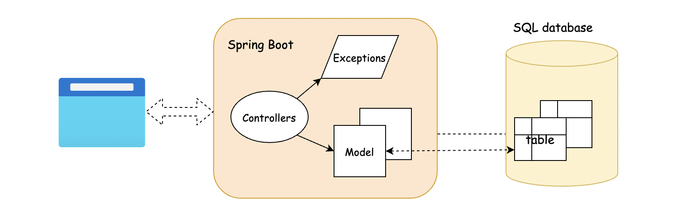
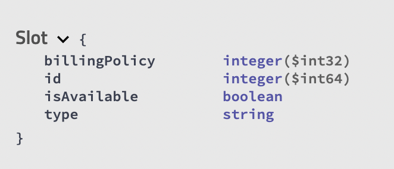
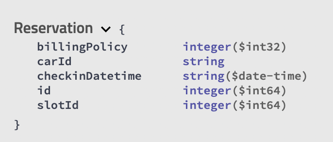
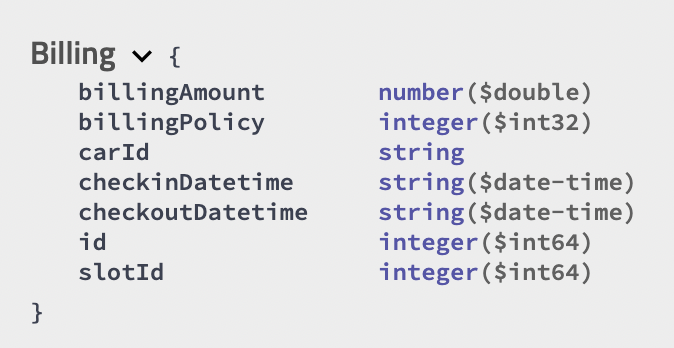
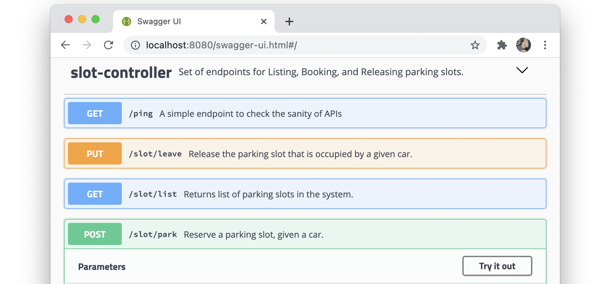
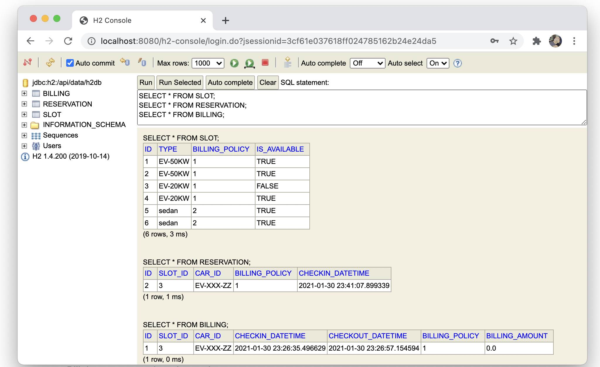

# toll-parking

This is a demo project that demonstrates how to build a full-fledged RESTful APIs with the [Spring Boot framework](https://spring.io/projects/spring-boot) in Java.

Also, the project demonstrates how to integrate various services and frameworks, such as [Swagger UI](https://swagger.io/tools/swagger-ui/) for API documentation, [H2 database](https://www.h2database.com/html/main.html) to manage the data, and how to package the APIs with [maven](https://maven.apache.org/) and [docker](https://www.docker.com/).

In addition, this project utilises the **CI/CD** functionalities provided by the [Github Actions](https://github.com/liaison/toll-parking/actions) and [Github Packages](https://github.com/liaison?tab=packages&repo_name=toll-parking) services.

### Application Scenarios

The set of APIs implemented in this project is intended to simulate the scenario of managing parking slots.
Here are some conditions and requirements:

- In a parking lot, there could be several types of parking slots (generic slot for sedan, slots with 20kW/50kW power supply etc.)

- Different types of slots are intended for different cars, _i.e._ one cannot park an electric car on a normal sedan slot.

- There could be different billing policies for different slots, _e.g._ a fixed base + each hour spent on the slot.

- The car should be randomly assigned to any suitable slot.

- Once the car leaves the slot, the customer should be billed and the slot becomes once again available.

### Architecture



As illustrated above, the architecture is rather intuitive, where mostly the Spring Boot framework does the heavy-lifting.
To manage the data that is associating with the parking, we attach a SQL database (_i.e._ [h2db](https://www.h2database.com/html/main.html)) in the backend.
It consists of three tables, namely **Slot**, **Reservation** and **Billing**, which corresponds to three different entities as indicated by their names.

We list the attributes and their types in each table as follows:

<p float="left">
  
  
  
</p>

**Note:** _for the purpose of demo, the database would be resetted each time the APIs are deployed._
To change the behavior, one can adjust the settings in the **application.properties** file.

### How to Run

In this project, we provide several ways to deploy and run the APIs.
We demonstrate the prerequisites and the steps of each way in this section.

##### Docker

Arguably it is the most intuitive to run the APIs with Docker which recreates the entire virtual environment.

Before running the following commands, one should install the docker environment first.

```shell
# clone the git repository of the project
$> cd toll-parking

# build an image from the Dockerfile
$> docker build -t toll_parking .

# with the built image, we run the APIs as a container
$> docker run -dp 8080:8080 toll_parking
```

After the above steps, one should have the APIs running at the address of [http://localhost:8080](http://localhost:8080)


##### Maven

One could also manually package the API into a fat jar, and then simply run the jar with Java.

Before running the commands, one should first install a proper JDK environment (OpenJDK version 11 is recommended here).

```shell
# clone the git repository of the project
$> cd toll-parking/api

# compile and package the sources, based on the POM.xml file
$api> ./mvnw -B clean package -DskipTests

# Once compiled, one should find the jar file under the folder of "api/target", i.e. api-0.0.1.jar
$api> java -jar target/api-0.0.1.jar
```

As an alternative, one could download the prebuilt fat jar directly from the [Github Packages](https://github.com/liaison?tab=packages&repo_name=toll-parking) repository, instead of compiling it locally.


### API Access

Once deployed, the APIs can be consumed with different tools.

First of all, along with the APIs, we also deploy a web application called [Swagger UI](https://swagger.io/tools/swagger-ui/) that allows one to explore the APIs _interactively_.
The Swagger UI can be accessed by browser with the URL of [http://localhost:8080/swagger-ui.html](http://localhost:8080/swagger-ui.html). Here is how it looks like:



With the Swagger UI, one can find detailed information about each API, concerning its purpose and the parameters it needs.
Even better, one can try out the API directly via the Swagger UI.

##### HTTP Clients

Naturally, one can access the APIs via any tool that understands the HTTP protocol, _e.g._ the `curl` command-line tool on Linux, or [postman](https://www.postman.com/) (a desktop tool for testing).
We attach a collection of postman requests in the **test** folder.
One can import the collection into the postman and replay the requests.

Here we show a few examples on how we can access the APIs via curl.
By the way, one could also find the curl commands in the swagger UI.

```shell
# example 1). list all the slots in the system
$> curl -X GET "http://localhost:8080/slot/list" -H "accept: */*"

# example 2). park the car with the ID of "EV-XXX-ZZ" and the type of "EV-20KW"
$> curl -X POST "http://localhost:8080/slot/park?carId=EV-XXX-ZZ&type=EV-20KW" -H "accept: */*"
```

### Test and Debug

We put in place some frameworks and procedures to facilitate the testing and debugging of the APIs.

##### Unit Test Cases

Under the folder of _"api/src/test"_, one can find a series of test cases that are dedicated to verify the behaviors of APIs.

One can run the test cases locally with the following command:
```shell
$> ./mvnw test
```

More importantly, the unit test cases are parts of steps in our **CI/CD** pipeline.
At each push to the github branches, some pre-configured pipeline in Github Actions would be triggered to ensure that the changes do not bring new problems.


##### H2 Console

For the purposes of testing and debugging, we enable a web interface for one to access the backend database during the running time.

While the APIs are running, one can access the console of h2 database via the URL of [http://localhost:8080/h2-console](http://localhost:8080/h2-console).
One could find the login details in the **application.properties** file.
Here is what h2 console looks like:



Notably in the above graph, it shows that the car with the `carId=EX-XXX-ZZ` currently holds the parking slot of `slotId=3` in the table of **Reservation**.
Therefore, accordingly, in the table of **Slot**, the slot (`slotId=3`) is marked as not available.
Finally, in the table of **Billing**, it indicates that the car (`carId=EX-XXX-ZZ`) used to park on the same parking slot (`slotId=3`) not long ago.

